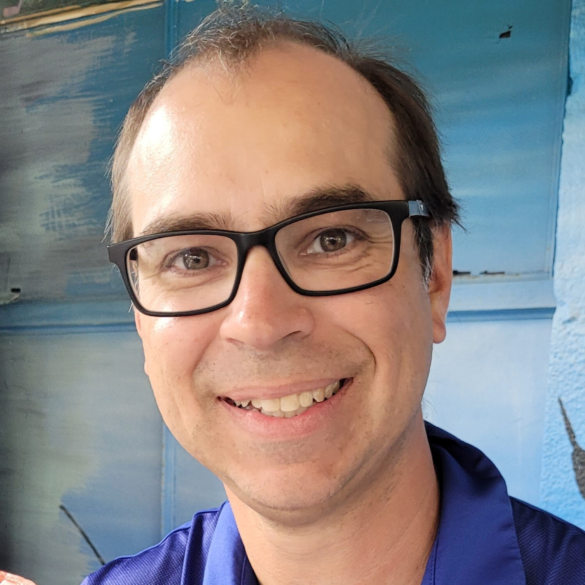
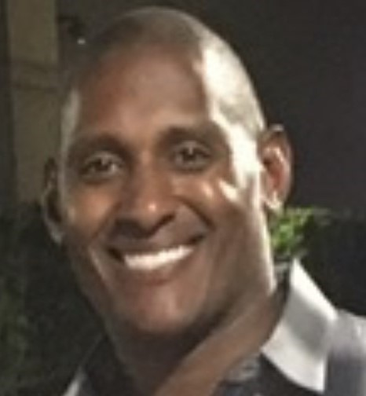
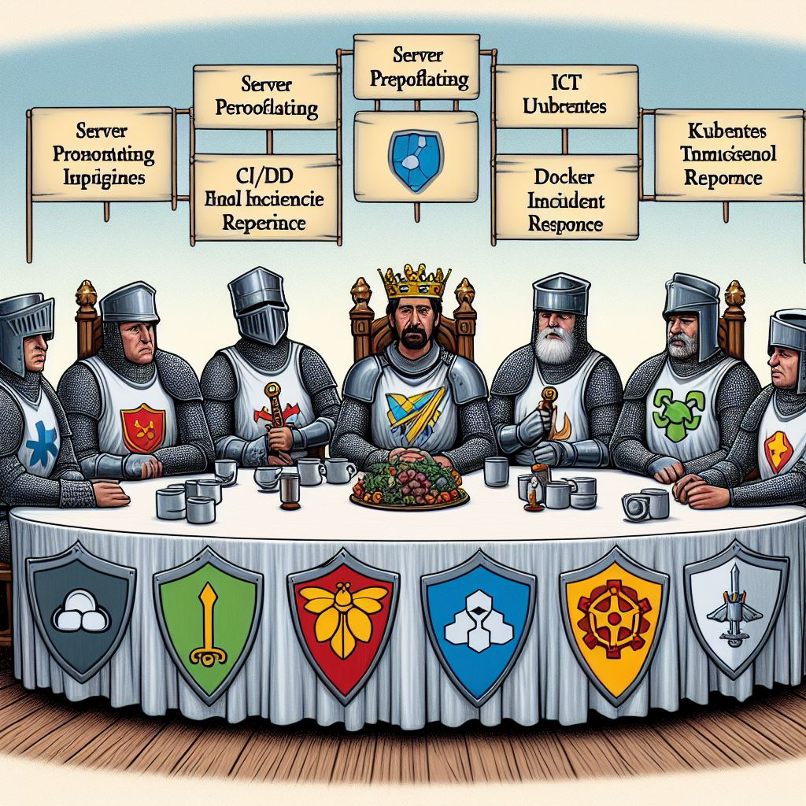
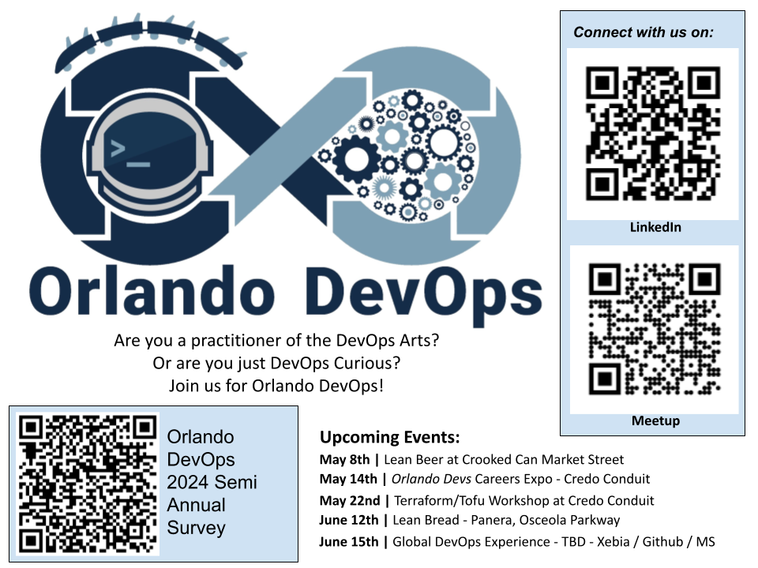

## Preparing for your next DevOps Role
### ODO Interview Series
#### An Orlando Devs Community Group

???
Notes:

* Welcome to another Orlando DevOps Community Group Meetup!
* This is the first in our Interview Series of Events.
* Today one of our own Orlando DevOps Community Meetup Members will sit down with four members of our DevOps Community and ask questions to learn how we can prepare for our next DevOps Role.
* Please complete the survey at the end of this presentation to let us know how we did.
* First some house keeping.
---
class: foo
 
## [Orlando Devs Code of Conduct](https://orlandodevs.com/code-of-conduct/)

> This code of conduct outlines our expectations for participants within the Orlando Devs community (relevant to both our Slack and Meetup), as well as steps to reporting unacceptable behavior. We are committed to providing a welcoming and inspiring community for all and expect our code of conduct to be honored. Anyone who violates this code of conduct may be banned from the community.

### Our community strives to:

#### **Be friendly and patient.**
#### **Be welcoming** We strive to be a community that welcomes and supports people of all backgrounds and identities. 
#### **Be considerate** Your actions (and words) affect users and colleagues, and you should take those consequences into account. Remember that we’re a very diverse community, so you might not be communicating in someone else’s primary language.
#### **Be respectful** Not all of us will agree all the time, but disagreement is no excuse for poor behavior and poor manners. It’s important to remember that a community where people feel uncomfortable or threatened is not a productive one.
#### **Be careful in the words that we choose** we are a community of professionals, and we conduct ourselves professionally. Be kind to others. Do not insult or put down other participants. Harassment and other exclusionary behavior aren’t acceptable.
#### **Try to understand why we disagree** Disagreements, both social and technical, happen all the time. It is important that we resolve disagreements and differing views constructively. 

???
Notes:

* As a member of the Orlando Devs Community, we agree to participate in their Code of Conduct and make it our own.
* Read the Code of Conduct
* Say the bullet points.
* You can find the complete Code of Conduct at orlando devs dot com. 
---
class: foo, center
## Thanks to our ODevs Sponsors

???
Notes: 

* Also, as a part of the Orlando Devs community, we are grateful for our sponsors that help provide spaces, food, and resources to all of the Orlando Devs Community Groups.
* Say Thank You to all of the sponsors on the list.
---

 
6:45 - Official Welcoming  
6:50 - Introduction of our host Mike Butler 
7:00 - Interview with Esteban Garcia 
7:15 - Interview with Milan Landaverde 
7:30 - Interview with Greg Brown 
7:45 - Interview with Aaron Kraft 
8:00 - Panel Q & A 
8:20 - Wrap up, Thank You, and Survey Link 
9:00 - The Ravenous Pig Beer Garden 
???
NOTES:

* This is the schedule for todays event. We will try to stay on schedule the best we can.
* Please note that following our event, you are welcome to meet up at The Ravenous Pig Beer Garden for more discourse.

---
class: center
# Ask a Question

???
NOTES:

* Scan this QR code and open the Google Form for Questions
* At any time during this presentation please submit a question. If we have time during individual interviews we will use your questions or save them for our round table at the end.
* Now I would like to thank Dan Myers for welcoming us in this beautiful facility and let him fill you in on some facility logistics.
---
class: foo, presenter
## Dan Myers - Rollins College

 
### PhD and Assistant Professor of Computer Science
 
#### Dan S. Myers, Ph.D., is an Associate Professor of Computer Science at Rollins College in Orlando, Florida. His research interests lie in computer performance modeling and queueing theory12. Dr. Myers received his Ph.D. in Computer Sciences from the University of Wisconsin-Madison.
#### In addition to his academic pursuits, Dr. Myers has a reputation for his dad jokes among his students. As one computer science major aptly put it, “Dr. Myers has two specialties: computer performance modeling and dad jokes” 3. It’s always refreshing to have a professor who can balance serious research with a good sense of humor!
#### If you're interested in learning more about the Computer Science program at Rollins College, you can explore the major in Computer Science or the minor in Data Analytics. Dr. Myers is actively involved in teaching and mentoring students in these fields, and his expertise contributes to the vibrant academic community at Rollins College.
???
* Introduce Dan Myers
* Dan talks about Rollins, the building, and parking validation.
* Mike grabs second Mike
* Dan Introduces Mike Butler
* Mike asks Dan a couple of questions before own introduction
---
class: foo, presenter
## Mike Butler - Progress Chef

 
### DevOps Enthusiast, Space Nerd, and Senior Sales Engineer
   
#### DevOps Enthusiast since 2016, space nerd and currently Sr. Sales Engineer at Progress for Chef Software. Mike has seen all sides of the Coded Enterprise, being the product owner for Chef at a very large healthcare organization. It is always a challenge to help application and OS support teams to understand “shifting left” or better local development, local testing, using a source code repository for code and helping to identify and track work. Treating Everything as Code helps drive DevOps for n00bs, it certainly helped him!
???
NOTES: (5 minutes)

* Thanks Dan! So before we jump in and to give folks a bit of a taste for what's to come this evening, I have a couple of questions for you.
* Tell me a little bit about the Computer Science program here at Rollins.
* What are some of the changes Rollins has made to modernize it's programs with the introduction of DevOps and Cloud & Platform Engineering?
* What do you see coming with the latest advances in AI? How is that changing the programs here at Rollins?

MY BIO (5 minutes)

* So, Hi there! My name is Mike Butler. I am a Solution Architect at Progress Chef. Ask me another time about being a Solution Architect or Chef, as a few folks here know, I can drone on for hours.
* Prior to working at Progress, I was a Sr. Manager at Optum which held the corporate IT platforms for all of UnitedHealth Group which included Optum and United Healthcare. I was there for 21 years, and the last ten I spend in a leadership position and have interviewed and hired my fair share of people across the globe.
* The last 6 years, I ran a team called DevOps Enablement Services where we primarily managed the Chef platform and Community of Practice. I had the fortune of building that team from scratch and brought folks will all sorts of backgrounds together to deliver a tools with a DevOps experience.

* So, I've said DevOps a lot there. And this is an Orlando DevOps Community Group Meetup.
* How many people think they have an understand of or can define DevOps? 
* Who is new to this terminology?
* Ok, so here is my definition of DevOps.
* I like to define it as a set of practices and principles that allow businesses to accelerate the delivery of products and services. There are a lot of things that DevOps is NOT. 
* It is NOT a job, although that is in contrary to the topic. 
* It is NOT a team, although I will often mention it that way.
* It is NOT a CI/CD pipeline, although many believe it to be.
* And it is NOT a Product, although Microsoft and others like to sell it that way.
* Well, actually it is a little bit all of those things and the term gets co-opted in that and more.
* To me, deep down, it's about Operational Tasks, moving them to a Development process and Mindset. 
* If you are a Developer, it is about including the Operations Tasks and thinking operationally about the things you deliver.
* Roles such as Cloud or Platform Engineer, Site Reliability Engineer, and even Software Engineers and IT Operations all play a part in DevOps. 

* I am also one of the organizers for our Orlando DevOps Community Group. Before we get started, I want to thank Mike Buchoff, Dan Crenshaw, Milan Landaverde, Jacob Hiers, and the newest member of our team who you got to meet first, Paulo De Souza.
* With that, I am stoked to be able to sit down with our guests today and get their perspectives on "Preparing for your next DevOps Role".

* Up First, I would like to welcome Esteban Garcia to the stage!
---
class: foo, presenter
## Esteban Garcia - CEO US Xebia

 
### Digital Transformation Leader | Cloud & DevOps Expert | Entrepreneur | Speaker
#### Esteban leads the Xebia Microsoft USA team. With more than 20 years of experience building enterprise software, Esteban has a passion for DevOps and Azure. He mentors, trains, and works closely with teams to help them realize their potential by leveraging Azure and DevOps practices to shorten the cycle time from idea to production. Esteban enjoys working with the software community, he is a Microsoft Regional Director, DevOps MVP, and Pluralsight author. Esteban also has a Bachelor of Science degree in Computer Engineering with an emphasis in software design from the University of Central Florida. Esteban is a huge UCF football fan - Go Knights!
???
NOTES: Discussing journeys, community and advice for people new to Computer Science.

Welcome Esteban. Little be known, Esteban ran the Orlando DevOps Meetup Group when I first met him. I am incredibly thankful for getting this started for us all. 

Esteban, want to introduce yourself?

* Tell me a little bit about your journey. How did you get to lead Xebia's US Microsoft Practice.
* When bringing in consultants to help your practice, what do you look for?
* You have been involved in starting or enhancing many of the Tech communities here including the .net group and our own Orlando DevOps Meetup, tell me why that was important to you.
* Do you look for community on candidates resumes?
* Do you encourage your team to participate in community events?
* What would you suggest to students currently studying CS? What should they do above classwork?

Thank you very much! Let's all give Esteban a hand for taking the time and willing to be first. He does a lot of speaking engagements, so I am sure it was no sweat.
---
class: foo, presenter
## Milan Landaverde - NVIDIA

  
### Senior Cloud Platform Software Engineer
    
#### Milan is a Senior Cloud Platform Engineer at NVIDIA, focusing on developer platforms & cloud enablement. Over the past decade, he has contributed to open source projects in the Kubernetes, Rust & eBPF ecosystems. He is also one of the core organizers of the Orlando DevOps Community Group.
???
NOTES: The Path from Student to Successful DevOps / Platform Engineer

Next we have Milan Landavere, who as I mentioned earlier is one of our co-organizers.

This meeting idea came from a Lean Beer event we were having and someone asked about what certifications to look at getting. Milan then said something that gave me chills. We'll get to that in a moment, but Milan, go ahead and introduce yourself.

* Tell me about your Journey
* Taking time - What you did when in between position.
* Why did you focus on Open Source Contribution rather than certifications?
* How did that help you get your NVIDIA job?
* What is the difference between working at a startup vs larger companies?
* Getting involved in community
* *What technologies are you using and feel are important in the DevOps landscape*

Thanks Milan! That was a great sit down and I wish we had a lot more time.

Greg Brown, come on down! You are the next contestant! 

---
class: foo, presenter

## Greg Brown - TekSystems

 
### Technology Operations & Infrastructure Services Recruiter
    
#### Greg Brown is a national Cloud/DevOps recruiter with TEKsystems based in Orlando. After a two-decade career in hospitality, a pause due to COVID prompted him to reevaluate his work-life balance. Witnessing the fulfillment his sister-in-law and wife found at TEKsystems, Greg made the transition, now in his fourth year with the company. He revels in the opportunity to impact lives daily, leveraging his specialization in the ever-evolving Cloud/DevOps realm. Greg thrives in building relationships across the US, Canada, and India, constantly learning and embracing the dynamic nature of both technology and recruitment.
???
NOTES: Working with candidates, what your customers are looking for and really what is Talent Sourcing.

I just recently met Greg through Nick Quintero who is an Account Manager for Tek Systems. Greg is a Technology Operations & Infrastructure Services Recruiter recruiter for TekSystems.

I have a real soft spot for TekSystems because way back when, they helped me find a position that really catapulted my career. They were amazing to work with back then and I've had conversations from TekSystems over the years, and it is always positive and friendly.

* Tell me a little bit about your journey.
* What is Talent Sourcing?
* How does someone successfully engage with a recruiter?
* What are the most important things on a persons resume?
* What is the market like right now?

Put it together for Greg. Greg, was this the first time being on a stage like this? You did awesome! 

Finally, I'd like to introduce someone whom I met when working for Progress. Funny story is that I had been there for about 2 months and I was told we hired a DevOps Centric VP of Software. I was super excited about that and when I started to learn more, it turned out he was not only here in Orlando, but lives about 5 miles!

---
class: foo, presenter

## Aaron Kraft - RXlive

 
### Transformational Technology Executive
     
#### Aaron Kraft began his technology career more than 25 years ago as a software developer in the early days of the internet. As a technologist with broad experience across multiple disciplines like distributed computing, big data, and cloud environments; Aaron continues to drive new approaches in everything from startups to Fortune 500 companies. Twice as a director of DevOps and now as the Chief Technology Officer for the Telehealth company RxLive has provided Aaron many opportunities to advance Agile, DevOps, and Digital transformations required to support the speed and complexity of today's technology systems.
???
NOTES: Digging in to DevOps and all of the Arts of Engineering

Welcome Aaron!! So, I mentioned working at Progress but tell me what you are up to now.

* Your background has been more around Software Engineering, tell me a little about your journey and when you discovered DevOps.
* Being a leader yourself, how do we keep DevOps or at least the founding principles in front of and an importance to Executive Leadership?
* Like Milan, you've worked at companies of all sizes most recently as the CTO of a start-up, what is that like?
* We were talking the other day and discussing the DevOps movement in general, what have we gotten right? What is next?
* What advice would you give people that are looking for that next level roll, moving into a leadership position?
* In working with you at Progress Chef, I know that an Agile Transformation is important. How does that tie to DevOps and what should those just starting out know?

Thank you, thank you!! Honestly, I can sit down over beer with Aaron and talk all day. I'm glad we still get to do just that a few times a year. 

---
class: center
## Knights of the DevOps Roundtable

???
NOTES:

It is that time of our night where we will invite all of our guests on stage for you to ask your questions. Let's look at the Q&A. 

While we compile a few of those, let me start off with one that I wanted to ask everyone. 

* Where do you think DevOps / Cloud & Platform Engineering / SRE is heading
* How do you see AI changing the jobs roles?
* Are you seeing applicants using AI for their resume?
* Tell me one thing everyone should do this weekend to make themselves a little more valuable on the market.

---
class: foo, center

---
class: center, thanks
# Thank You
Thanks again to our Sponsors and to Rollins College for Hosting!

You are welcome to meet us at The Ravenous Pig for more discourse.

