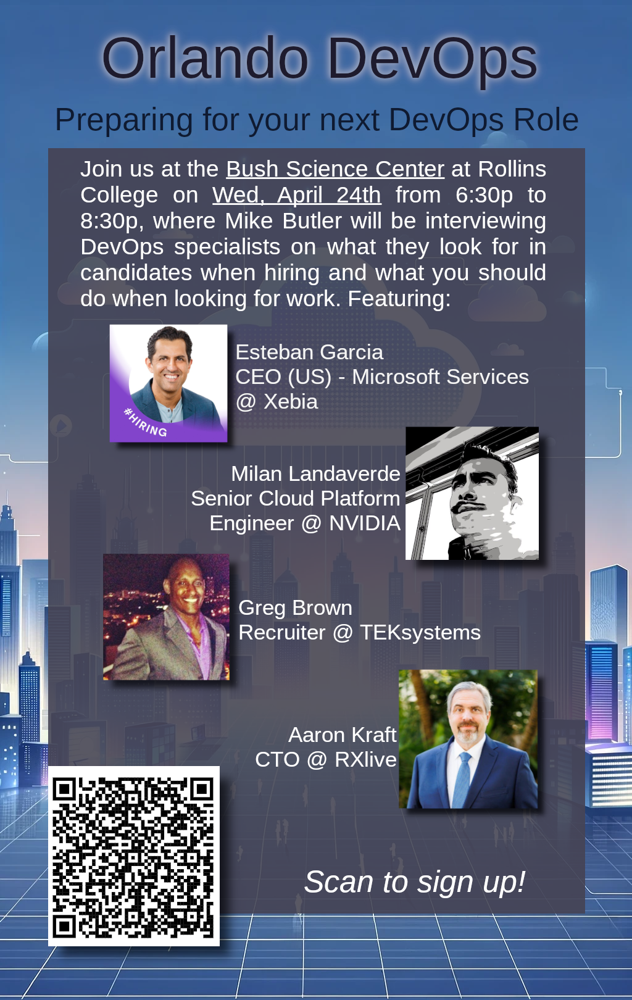

# Preparing for your next DevOps Role

## Details

> Are you looking for work? About to complete your program or degree? Just tired of your current role? Join us at The Bush Science Center Auditorium at Rollins College in Winter Park on April 24th at 6:30 pm to hear from experts in the DevOps industry on what they look for in candidates when hiring and what you should do when looking for work.

Our own Mike Butler will be interviewing the following individuals asking questions about their industries and what they look for when hiring or tips when you are looking for work.

Esteban Garcia - NA CEO of Xebia
Milan Landaverde - Senior Cloud Platform Engineer @ Nvidia
Nick Quintero / Greg Brown - TEKsystems
Aaron Kraft - CTO - RXlive

We will ask questions of our guests for about 20 minutes each and then bring everyone back on stage for a round table / Q&A panel. Bring your questions with you!

